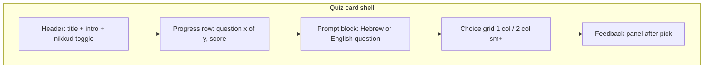

# Learn UI patterns: flashcards, quizzes, reading passages

This document describes **visual and structural patterns** used across the Hebrew app’s study surfaces. It aligns with existing implementations so new screens feel native to the parchment / sage system.

**Hooks in Learn routes:** see [react-hooks-patterns.md](./react-hooks-patterns.md) — keep `useMemo` / `useCallback` / `useEffect` above any early `return` (CI enforces `rules-of-hooks`).

**Reference components**

| Pattern | Primary implementation |
|--------|-------------------------|
| Multiple-choice quiz shell | `web/components/McqDrill.tsx` |
| Passage + English comprehension quiz | `web/components/ComprehensionDrill.tsx` |
| Tap-to-hear Hebrew | `web/components/HebrewTapText.tsx` |
| Reading hub carousel + in-modal passage/quiz | `web/components/ReadingTapCarousel.tsx` |
| Section “primer” word rows (static cards) | `web/components/LessonPrimerPanel.tsx` |
| Global tokens & elevated surfaces | `web/app/globals.css` (`surface-elevated`, `btn-elevated-*`, `input-inset`) |

---

## Shared tokens (use consistently)

- **Page chrome**: warm parchment background (`bg-parchment-grain` where the route already uses it), `text-ink` body, `text-ink-muted` secondary.
- **Section label**: `font-label text-[10px] uppercase tracking-[0.18em] text-ink-muted` (MCQ) or `text-[9px] tracking-[0.15em]` (comprehension source line)—pick one per feature and stay consistent.
- **Accent / success**: `text-sage`, `border-sage/20`–`border-sage/25`, `bg-sage/5`–`bg-sage/15`.
- **Incorrect emphasis**: `ring-rust/40`, `bg-rust/10` (never rely on color alone; keep copy like “The answer is …”).
- **Cards**: `rounded-2xl border border-ink/12 bg-parchment-card/90 p-4` for primary study panels.
- **Inset feedback blocks**: `rounded-lg border border-ink/10 bg-parchment/80 p-3 text-sm`.
- **Primary CTA in-card**: `rounded-lg bg-sage px-4 py-2 font-label text-[10px] uppercase tracking-wide text-white hover:brightness-110`.
- **Secondary / neutral CTA**: `rounded-lg border border-ink/15 bg-parchment-card px-4 py-2 font-label text-[10px] uppercase tracking-wide text-ink hover:bg-parchment-deep/40`.
- **Hebrew display**: prefer `<Hebrew>` or `HebrewTapText` with `text-right` for isolated lemmas; passage body often `text-base sm:text-lg`.
- **Focus**: interactive controls should keep `focus-visible:ring-2 focus-visible:ring-sage` (see `SaveWordButton`).

---

## 1. Flashcards (pattern spec)

There is no global “flip” flashcard component yet; **new flash UIs should follow this contract** so they can merge with Study / Learn later.

### 1.1 Layout

- **Container**: `max-w-lg mx-auto` (or match parent column used by Learn sections).
- **Card face**: same shell as quizzes—`rounded-2xl border border-ink/12 bg-parchment-card/90 p-4` (or `surface-elevated` for stronger lift on hub-style pages).
- **Min height**: optional `min-h-[11rem]` so front/back don’t jump wildly when content is short.

### 1.2 Front face (prompt)

- **Lemma line**: `<Hebrew className="text-right text-2xl font-medium leading-relaxed text-ink">` (adjust `text-xl`–`text-3xl` by density).
- **Optional transliteration**: `text-sm text-ink-muted`, LTR under or beside Hebrew; don’t compete with the lemma size.
- **Toolbar row**: align with `McqDrill`—`flex flex-wrap items-start justify-between gap-2` with `NikkudExerciseToggle` on the trailing edge when nikkud applies.
- **Audio**: icon or “Play” control with `aria-label` in Hebrew or English; reuse `speakHebrew` patterns from reading/tap flows.

### 1.3 Back face (answer)

- **English gloss**: `text-lg font-medium text-ink` or `text-base text-ink-muted` for longer definitions.
- **Optional example sentence**: smaller `text-sm text-ink-muted`, Hebrew in `<Hebrew>` if shown.

### 1.4 Flip / navigation

- **Flip control**: `btn-elevated-secondary` or compact `rounded-xl border border-ink/12 px-3 py-2 font-label text-[10px] uppercase`.
- **Keyboard**: Space or Enter toggles flip when focus is on the card region; arrow keys for deck advance if you build a stack.
- **Motion**: respect `prefers-reduced-motion: reduce`—instant cross-fade or no 3D transform.

### 1.5 Deck progress

- Mirror quizzes: `flex justify-between text-[10px] text-ink-faint` for “Card *i* of *n*” and optional streak/score.

### 1.6 Static “flashcard-like” rows (today)

`LessonPrimerPanel` word rows use a **lightweight list card**:

`rounded-lg border border-ink/8 bg-parchment/60 px-3 py-2` with Hebrew then English below—use this for glossary-style stacks, not for full flip decks.

---

## 2. Quizzes (MCQ and comprehension)

### 2.1 Anatomy



### 2.2 Shell classes (active question state)

```txt
rounded-2xl border border-ink/12 bg-parchment-card/90 p-4
```

### 2.3 Progress row

```txt
mt-4 flex justify-between text-[10px] text-ink-faint
```

### 2.4 Prompt

- **Hebrew prompt** (e.g. `McqDrill`): `Hebrew` with `text-right text-xl font-medium leading-relaxed text-ink`; pair with `SaveWordButton` `variant="compact"` in the same flex row when the feature is on.
- **English question** (e.g. `ComprehensionDrill`): `mt-3 text-sm font-medium text-ink`.

### 2.5 Choice grid

- **Layout**: `grid grid-cols-1 gap-2 sm:grid-cols-2`.
- **Loading** (server choices): reserve `min-h-[120px]` and skeleton `h-14 animate-pulse rounded-xl bg-parchment-deep/50` with `aria-busy="true"`.
- **Default button**: `rounded-xl px-3 py-3 text-sm text-ink transition` + `ring-1 ring-ink/12 hover:bg-parchment-deep/50 hover:ring-ink/20`.
- **Hebrew options**: `dir="rtl" text-right font-hebrew` on the `<button>` (see `McqDrill`).
- **After selection**:
  - Correct: `bg-sage/15 ring-2 ring-sage`
  - Wrong picked: `bg-rust/10 ring-2 ring-rust/40 opacity-90`
  - Other options: `opacity-50 ring-1 ring-ink/8`
- **Disabled** after pick: `disabled={picked != null}` to prevent double submission.

### 2.6 Feedback panel

```txt
mt-4 rounded-lg border border-ink/10 bg-parchment/80 p-3 text-sm
```

- Correct line: `text-sage` (“Correct.”).
- Wrong line: `text-ink-muted` plus strong answer; comprehension may use `q.note`.

### 2.7 Completion state (end of pack)

- **Container**: `rounded-2xl border border-sage/25 bg-sage/5 p-4`.
- **Title**: `font-label text-[10px] uppercase tracking-[0.18em] text-sage`.
- **Score**: `text-sm text-ink` with `<strong>` for counts.
- **Secondary action**: bordered “Practice again” matching `McqDrill` / `ComprehensionDrill`.

---

## 3. Reading passages

### 3.1 Passage + translation (comprehension style)

Two stacked cards in `ComprehensionDrill`:

1. **Passage card**  
   - Source line + `NikkudExerciseToggle`.  
   - Body: `HebrewTapText` with `text-base sm:text-lg`, `showSaveWord` when word-level save is desired.  
   - English gloss: `mt-4 border-t border-ink/10 pt-4 text-sm italic leading-relaxed text-ink-muted`.  
   - Optional note: `mt-3 rounded-lg border border-sage/20 bg-sage/5 px-3 py-2 text-xs text-ink-muted`.

2. **Questions card**  
   - Same quiz choice + feedback pattern as §2.

**Spacing between cards**: `space-y-6` on the outer wrapper.

### 3.2 Carousel / hub reading (`ReadingTapCarousel`)

- Cover cards use `CoverFlowCarousel`; keep **short descriptions** (≤ ~140 chars) for density.
- **Modal passage**: generous padding, tap targets per token, clear **Start exercises** when `tq` / `wq` exist—quiz inside modal should reuse the same **choice ring semantics** as §2.5 for consistency.

### 3.3 Typography rhythm

- Passage: comfortable line height (`leading-relaxed`); avoid cramming nikkud into too small a size on mobile.
- Translation and notes: visually subordinate (smaller, muted, or italic).

---

## 4. Accessibility checklist

- Quiz options are **real `<button type="button">`**, not `div` + `onClick`.
- Announce busy loading states (`aria-busy`, `aria-label`) for choice areas.
- **Feedback**: use `role="status"` / `aria-live="polite"` where hints appear without focus move (see `SaveWordButton` hint).
- **Color**: wrong/correct states also change ring/weight; pair with text.
- **Keyboard**: primary actions reachable in tab order; modals trap focus via existing `AppShell` modal behavior.

---

## 5. Quick copy-paste recipes

**Primary study card**

```html
<div class="rounded-2xl border border-ink/12 bg-parchment-card/90 p-4">…</div>
```

**Completion card**

```html
<div class="rounded-2xl border border-sage/25 bg-sage/5 p-4">…</div>
```

**MCQ choice (idle)**

```html
<button type="button" class="rounded-xl px-3 py-3 text-sm text-ink transition ring-1 ring-ink/12 hover:bg-parchment-deep/50 hover:ring-ink/20">…</button>
```

**Flashcard lemma (front)**

```html
<p class="text-right text-2xl font-medium leading-relaxed text-ink font-hebrew" dir="rtl">…</p>
```

---

## 6. When to add new primitives

If three or more screens duplicate the same class string blocks, consider extracting a small wrapper (e.g. `StudyCardShell`, `StudyChoiceButton`) **next to** `McqDrill` / `ComprehensionDrill` rather than inventing a parallel style. Until then, treat this doc and those files as the source of truth.
